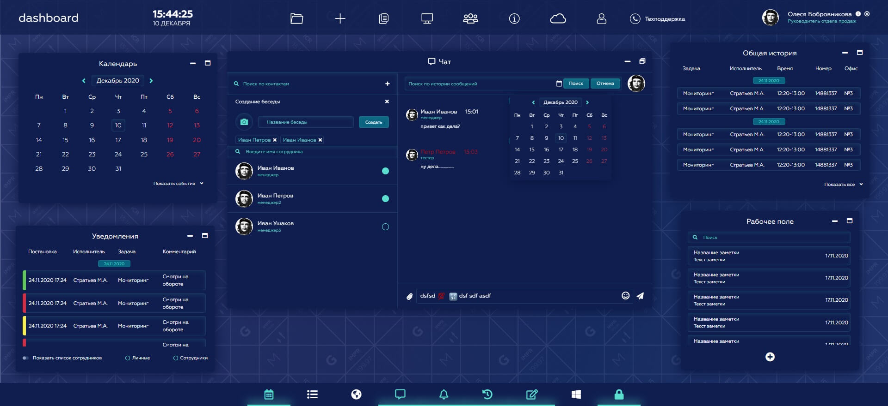
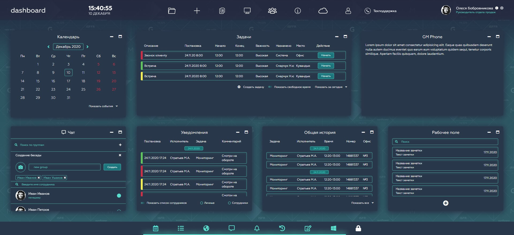

### dashboard
#### Stack: jQuery, Bootstrap
 github pages:    [dashboard](https://dsa25.github.io/lk-fmk/)

 
Для темы использовались css-переменные еще в далеком 2020

 
Также заюзал svg-спрайты. Не отображаются локально и градиенты в спрайтах не отработали

 
Состояние окон хранится в localStorage

 
Окна можно перемещать, менять размеры, сохранять и закреплять состояние

 

 
Работать с DOM-деревом дорого, когда нужно 800 смайликов добавить.

 
DocumentFragment - не про это

 
insertAdjacentHTML  - ничем не быстрее  elem.innerHTML  

 
 #### screenshots:
 <table>
   <tr>
    <th>theme default</th>
    <td valign="top"></td>
  </tr>
   <tr>
    <th>theme lime</th>
    <td valign="top"></td>
  </tr>
 </table>
